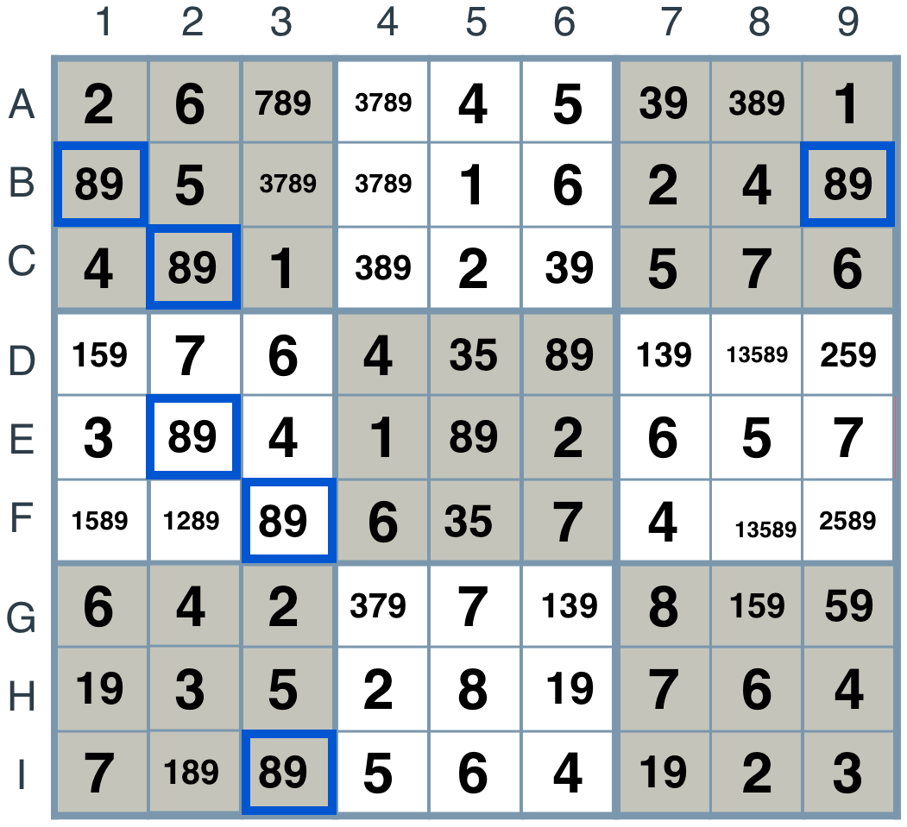
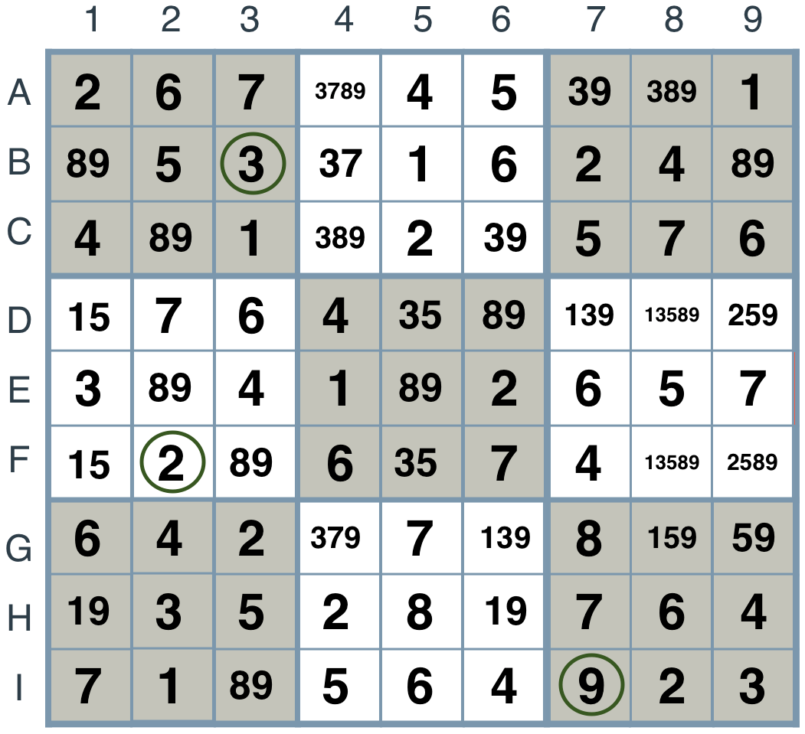
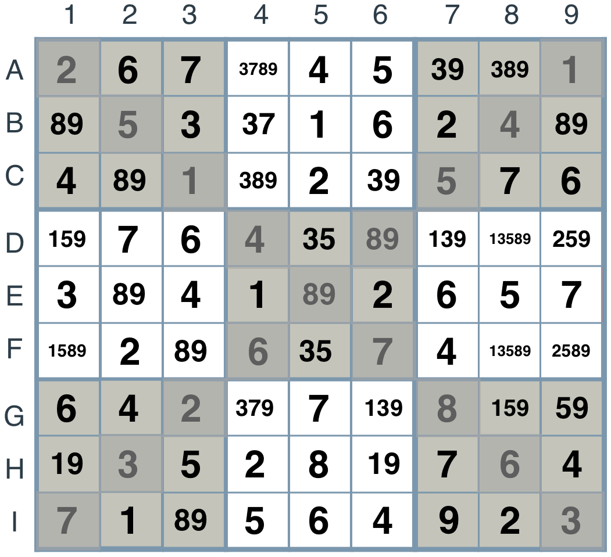

# Artificial Intelligence Nanodegree
## Introductory Project: Diagonal Sudoku Solver

# Question 1 (Naked Twins)
Q: How do we use constraint propagation to solve the naked twins problem?  
A: **Contraint Propagation** is a powerful technique used in AI to dramatically reduce the search space for solving a given problem iteratively applying and pushing constraints forward until a final solution is found.  For Sudoku, the constraints are the rules that a box can only have a single digit from 1 to 9 and the digits *must* only occur once in a given unit: 9 rows, 9 columns, 9 3x3 squares.  The **naked twins** technique is to find *hidden pairs* of two digits in one or more units in a sudoku puzzle that maybe *hidden* by other candidates in those units.  The technique works because of the contraints in sudoku.  The hidden pairs are actually **locked** in their boxes because of how the constaints behave with respect to the units that the boxes belongs.  To illustrate this technique, let's observe the following sudoku puzzle in progress:



We can see that the **"89"** pair seems to be in a lot of boxes as possible solutions of either **8** or **9**, but we are currently not able to assign any one of them to its box.  We also know some of them are **locked** because there are two of the pairs in a unit.  Because of their **locked** state, we can search the pairs digits in the other boxes in the unit that the pairs belongs to and remove those digits from the other squares possibilities.  This is called **naked twins** because we are revealing them from their hiding spots and exposing them for all to see.  See [http://www.sudokuwiki.org/Hidden_Candidates](http://www.sudokuwiki.org/Hidden_Candidates) for a full discussion on **hidden candidates/hidden pairs** and **naked twins** technique for sudoku.  Below, we have identify some of the **"89"** hidden pairs in their units.  Some of the squares belong to more than one units as can be observed by square **B1**.  **B1** belongs to row **B1 B2 B3 B4 B5 B6 B7 B8 B9**, column **A1 B1 C1 D1 E1 F1 G1 H1 I1** as well as **A1 A2 A3 B1 B2 B3 C1 C2 C3**.  If the unit that a two digit pair belongs to also have an identical **twin**, then we can apply the **naked-twin** and remove their digits from other peers belonging to the same unit as illustrated with the *red* slashes in the picture below.


Once we remove those digits, we find that we have found an additional 2 solution for boxes **A3** and **I2** and are closer to finding a solution to the sudoku puzzle.


Howerver, that is not all.  Because we now have a solution for **A3** and **I2**, we can use our *elimination* technique to find additional solutions as can be illustrated below:


And thus, find 3 additional solutions that were hidden before:



Thus, this series of cascading eliminations and solution finding based on the constraints of the problem space is the application of **Contraint Propagation**.  The code that implements the **naked-twins** technique is located in [solution.py](./solution.py) starting at line 25.

# Question 2 (Diagonal Sudoku)
Q: How do we use constraint propagation to solve the diagonal sudoku problem?  
A: A diagonal sudoku is like a regular sudoku, except that among the two main diagonals, the numbers 1 to 9 should all appear exactly once. In this project we will solve every diagonal sudoku too.  Below is a visualization of what this additional diagonal constraints looks like:


To explain how this helps to actually solve the puzzle and obtain a solution quicker, please look at the illustrations below.  We start off where we left off with the same sudoku puzzle in progress in the last question, but this time we will also impose the diagonal sudoku constraints:



Notice that the **8** value in box **G7** as illustrated below is now eliminating **8** as a possible solution candidate for box **E5** with the new diagonal constraints.


Once **8** has been eliminated and **9** is the only solution for **E5**, its constraints can now be propagated forward and applied to other boxes in units that **E5** belongs.


By further applying the **elimination**, **only choice**, **naked-twin** and **search tree** techniques, we can use **constraint propagation** to solve the sudoku puzzle in all its forms including the diagonal sudoku with its new diagonal units **A1 B2 C3 D4 E5 F6 G7 H8 I9** and **A9 B8 C7 D6 E5 F4 G3 H2 I1**.  The code that implements the additional **diagonal constraints** is located in [solution.py](./solution.py) starting at line 92.

### Install

This project requires **Python 3**.

We recommend students install [Anaconda](https://www.continuum.io/downloads), a pre-packaged Python distribution that contains all of the necessary libraries and software for this project. 
Please try using the environment we provided in the Anaconda lesson of the Nanodegree.

##### Optional: Pygame

Optionally, you can also install pygame if you want to see our visualization. If you've followed our instructions for setting up our conda environment, you should be all set.

If not, please see how to download pygame [here](http://www.pygame.org/download.shtml).

### Code

* `solutions.py` - This code implements our solution.
* `solution_test.py` - Do not modify this. You can test your solution by running `python solution_test.py`.
* `PySudoku.py` - Do not modify this. This is code for visualizing your solution.
* `visualize.py` - Do not modify this. This is code for visualizing your solution.

### Visualizing

To visualize the solution, we only assign values to the values_dict using the ```assign_values``` function provided in solution.py.  This will allow us to see and track the AI agents behavior when solving the sudoku puzzle:


### Data

The data consists of a text file of diagonal sudokus for you to solve.

### Conclusion

This was a great project to add to my portfolio.  I hope you will enjoy playing with it.  Cheers!
